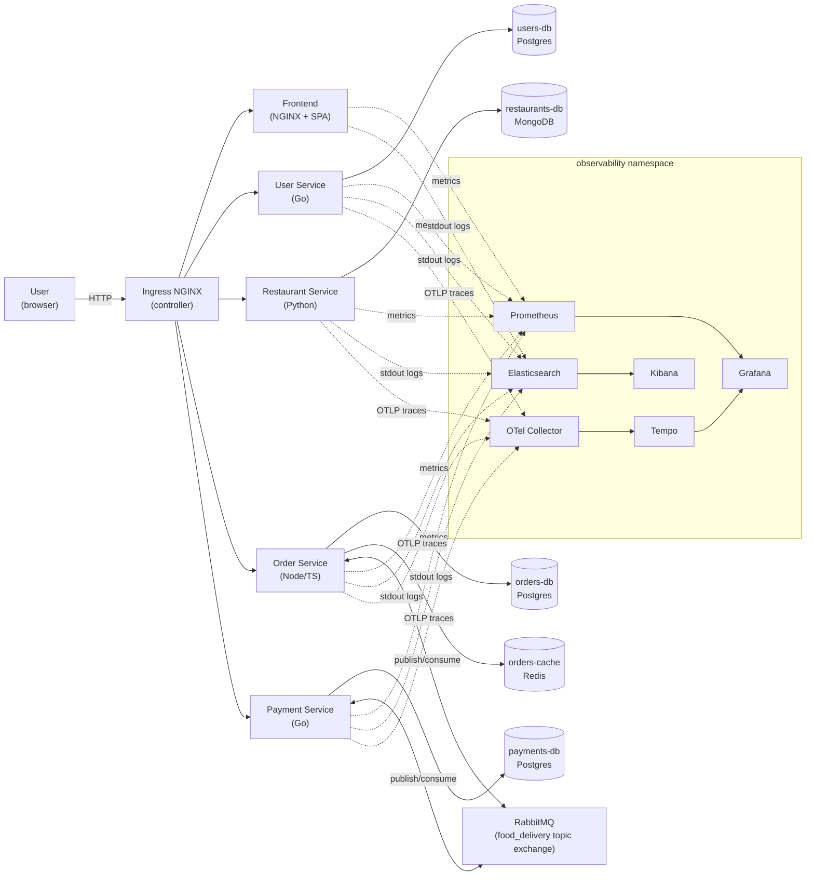
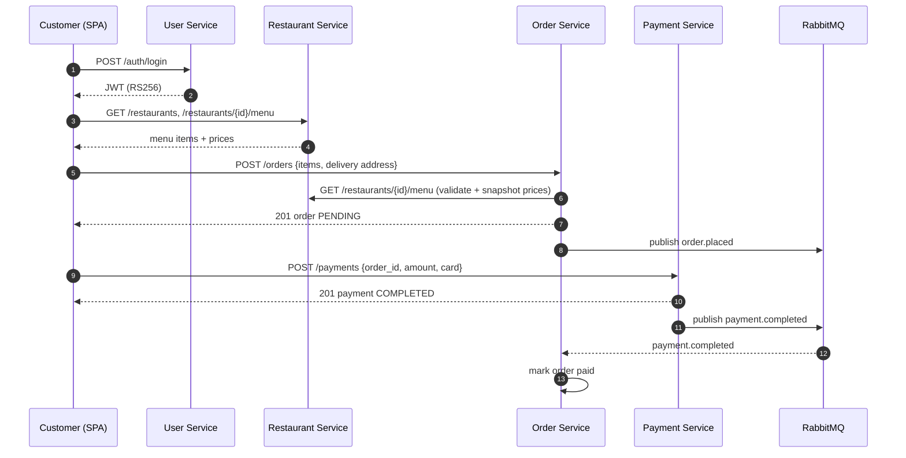
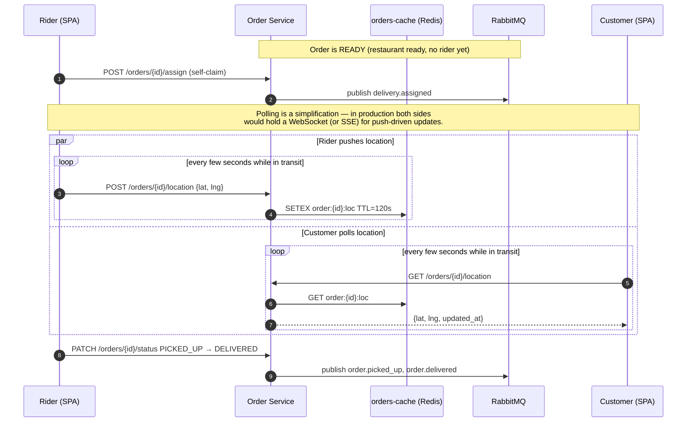
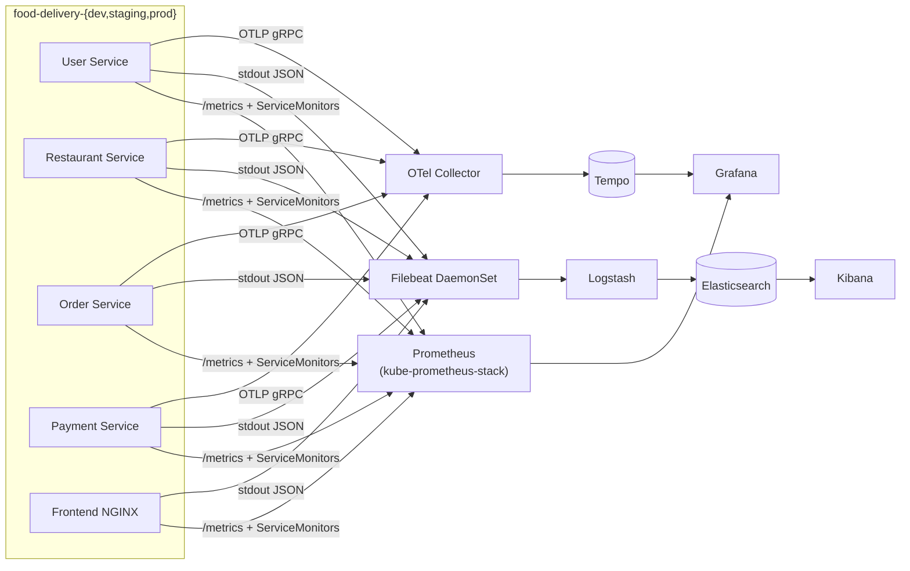

# Food Delivery Platform

A polyglot microservices food-delivery system built around four backend services
(User, Restaurant, Order, Payment), a static SPA frontend, RabbitMQ as the
event bus, per-service datastores, and a full three-pillar observability
stack. The same code targets local Docker Compose for everyday iteration and
Minikube + Kustomize for the Kubernetes story. The platform serves three user
roles end-to-end: **customers** (browse restaurants, place and pay for
orders), **restaurant owners** (publish menus, accept/prepare orders), and
**delivery riders** (claim ready orders, push live location, mark
delivered).

## Architecture

The system is a small set of single-responsibility services that talk to
each other in two ways. Synchronous HTTP for read-after-write paths
(authenticate, fetch a restaurant menu, fetch an order) and asynchronous
events on RabbitMQ for everything that drives the order lifecycle
(`order.placed`, `payment.completed`, `order.ready`, `order.delivered`,
…). Each service owns its database — there is no shared schema and no
cross-service joins. The frontend is a static SPA served by an in-pod
NGINX; a separate ingress NGINX sits in front of everything as the
single public entry point. JWTs (RS256) are minted by User Service and
verified independently by every other service using a public-key
ConfigMap.

### Component diagram



### Order placement (happy path)



### Real-time delivery tracking



### Observability data flow



## Components

**User Service** — Go (Gin) on Postgres. Owns accounts, profiles, and
authentication. Hashes passwords with bcrypt; mints RS256 JWTs and exposes
the matching public key at `/.well-known/jwks.pem`. No events.

**Restaurant Service** — Python 3.12 (FastAPI) on MongoDB. Owns
restaurants and their menus (one-to-many embedded model). Verifies JWTs
locally with the shared public key. No events; called synchronously by
Order Service when a customer places an order.

**Order Service** — Node 20 / TypeScript (Express) on Postgres + Redis.
Owns the order lifecycle state machine
(`PENDING → ACCEPTED → PREPARING → READY → PICKED_UP → DELIVERED`,
plus `REJECTED` / `CANCELLED`) and live delivery-rider geolocation
(short-TTL keys in Redis). Publishes `order.placed`, `order.accepted`,
`order.rejected`, `order.ready`, `order.picked_up`, `order.delivered`,
`order.cancelled`, `delivery.assigned`. Consumes `payment.completed`,
`payment.failed`.

**Payment Service** — Go (Gin) on Postgres. Mock card processor: any
card number ending in `0000` is declined, everything else clears. Cash
on delivery is supported as a separate flow that stays `PENDING` until
the rider calls `/payments/by-order/{id}/collect`. Publishes
`payment.pending`, `payment.completed`, `payment.failed`. Consumes
`order.cancelled` (refund hook — currently a no-op log line).

**Frontend** — Single static SPA (`public/app.js` + `index.html`)
served by NGINX. One UI for all three roles, picked at registration
time. No build step. Includes a Leaflet map for delivery pickers and
live tracking; default center is Cairo.

**Infrastructure** — RabbitMQ as the only shared piece (topic exchange
`food_delivery`). Each backend service has its own database
(`users-db`, `restaurants-db`, `orders-db`, `payments-db`). Redis
(`orders-cache`) only stores ephemeral rider locations, never
authoritative state.

**Observability** — kube-prometheus-stack (Prometheus + Alertmanager +
Grafana) for metrics, ECK ELK (Elasticsearch + Logstash + Kibana +
Filebeat) for logs, Tempo + OTel Collector for traces. All three
pillars deploy once into a shared `observability` namespace and watch
all three application namespaces simultaneously.

**Ingress** — Minikube's NGINX Ingress controller is the single public
entry point on Kubernetes; one Ingress per env routes
`<env>.food-delivery.local` and a separate observability Ingress
routes `*.observability.local`. Note that there are two NGINXes in
play: this **ingress controller** at the cluster edge, and the
**frontend pod's NGINX** that just serves static SPA files. Compose
uses Traefik as the gateway instead.

## Project Structure

```
food-delivery/
├── services/                    # all microservices, one directory each
│   ├── user-service/            # Go + Gin + Postgres
│   ├── restaurant-service/      # Python + FastAPI + MongoDB
│   ├── order-service/           # Node/TS + Express + Postgres + Redis
│   ├── payment-service/         # Go + Gin + Postgres
│   └── frontend/                # NGINX serving a static SPA
├── compose/                     # Docker Compose stack
│   ├── docker-compose.yml       # base topology
│   ├── docker-compose.dev.yml   # build images, expose all ports
│   ├── docker-compose.staging.yml  # pull staging images
│   ├── docker-compose.prod.yml  # pull pinned images, no debug ports
│   ├── .env.example             # copy to .env.dev / .env.staging / .env.prod
│   └── scripts/gen-keys.sh      # generates the JWT keypair for Compose
├── k8s/                         # Kubernetes (Kustomize) deployment
│   ├── base/                    # apps + per-service infra + base ingress
│   ├── overlays/{dev,staging,prod}/   # per-env namespace, image tag, replicas
│   └── observability/           # Prometheus / ELK / Tempo manifests + Helm values
├── scripts/                     # operator scripts
│   ├── app-env-bootstrap.sh     # creates a namespace, JWT keypair, pull secret
│   ├── observability-bootstrap.sh   # idempotent install of the observability stack
│   ├── observability-teardown.sh    # symmetric uninstall
│   ├── build.sh                 # docker build a single service
│   └── publish.sh               # docker push to a registry
└── specs/                       # design notes (not required reading)
```

## Prerequisites

- **Docker Engine** 24+ with **Docker Compose v2** (`docker compose`, not `docker-compose`)
- **Minikube** 1.32+ with the `ingress` and `metrics-server` addons enabled
- **kubectl** matching your cluster's minor version
- **Helm** 3.12+
- **OpenSSL** (for JWT keypair generation)
- A Bash-compatible shell (the scripts use `bash`)
- `/etc/hosts` write access to map the ingress hostnames:

```
$(minikube ip)  dev.food-delivery.local
$(minikube ip)  staging.food-delivery.local
$(minikube ip)  food-delivery.local
$(minikube ip)  grafana.observability.local
$(minikube ip)  kibana.observability.local
$(minikube ip)  prometheus.observability.local
```

No language toolchains are required on the host — every service builds inside
Docker.

## Development Environment Setup

The fast iteration loop is Docker Compose. From clone to a working SPA in the
browser:

```bash
# 1. Clone
git clone <this-repo> food-delivery && cd food-delivery

# 2. Per-env env files (one-time)
cp compose/.env.example compose/.env.dev
cp compose/.env.example compose/.env.staging
cp compose/.env.example compose/.env.prod
# edit each so COMPOSE_PROJECT_NAME differs (food-delivery-dev, …)

# 3. JWT keypair for Compose (one-time)
compose/scripts/gen-keys.sh        # writes compose/jwt/{jwt.key,jwt.pub}

# 4. Bring up the dev stack (builds every image first run)
docker compose \
  -f compose/docker-compose.yml \
  -f compose/docker-compose.dev.yml \
  --env-file compose/.env.dev \
  up --build
```

URLs once the stack is healthy:

| What | URL |
|---|---|
| Frontend (SPA) | <http://localhost:3000> |
| Traefik dashboard | <http://localhost:8090> |
| RabbitMQ UI | <http://localhost:15672> (`guest` / `guest`) |
| Direct service ports (dev only) | `:8081` user, `:8082` restaurant, `:8083` order, `:8084` payment |

## Image Build & Publish

Both the Compose staging/prod stacks and the Kubernetes staging/prod overlays
pull images from a container registry — by default GitHub Container Registry
(`ghcr.io/<owner>/<service>:<version>`). The same publish flow feeds both.

```bash
# Log in once (needs a PAT with write:packages)
echo "$CR_PAT" | docker login ghcr.io -u <github-username> --password-stdin

# Publish a single service
./scripts/publish.sh <service> <version>

# Publish all services at one version
for s in user-service restaurant-service order-service payment-service frontend; do
  ./scripts/publish.sh "$s" v1.0.0
done
```

The published tag must match what the consuming env expects:

- **Compose staging/prod** read `REGISTRY` and `IMAGE_TAG` from
  `compose/.env.<env>`. Set them to the registry namespace and version you
  just pushed.
- **Kubernetes staging/prod** pin the registry + tag inside
  `k8s/overlays/<env>/kustomization.yaml`'s `images:` block. Update
  `newName` and `newTag` after each publish, or run
  `kustomize edit set image food-delivery/<svc>=ghcr.io/<owner>/<svc>:<version>`
  from inside the overlay directory.

Staging and prod follow the **same** convention — both pin a specific semver
tag pushed via the same script. There is no floating `:staging` tag; staging
tracks prod's exact version.

> The registry namespace and the overlay tags are currently hardcoded:
> `OWNER=thepaintester` in `scripts/publish.sh` and
> `ghcr.io/thepaintester/<svc>:v1.0.0` in
> `k8s/overlays/{staging,prod}/kustomization.yaml`. For a fork, change `OWNER`
> in `publish.sh` (or expose it via env var) and update each overlay's
> `newName` / `newTag` to your namespace and the version you publish.

## Building Images Locally

You can build images locally and specify a version using `./scripts/build.sh`

```bash
./scripts/build.sh <service> <version>
```

## Compose Deployment (multi-environment)

All three environments are isolated by `COMPOSE_PROJECT_NAME` (set in their
`.env.<env>` file) — networks, volumes, and container names get auto-prefixed,
so the three stacks can run simultaneously on one host.

### Development

Builds images locally from `services/*`, exposes every port for debugging,
`restart: "no"`.

```bash
docker compose -f compose/docker-compose.yml -f compose/docker-compose.dev.yml \
  --env-file compose/.env.dev up -d --build
```

### Staging

Pulls pinned `${REGISTRY}/<svc>:${IMAGE_TAG}` images — same shape as prod, since
staging tracks prod's exact version so the pre-release env matches what's about
to ship. See [Image Build & Publish](#image-build--publish) for how to push the
tag that `.env.staging` references. Exposes the gateway on `:8080` plus the
RabbitMQ UI; data stores stay internal. `restart: unless-stopped`.

```bash
docker compose -f compose/docker-compose.yml -f compose/docker-compose.staging.yml \
  --env-file compose/.env.staging up -d
```

### Production

Pulls pinned `:${IMAGE_TAG}` images. Publishes only `:80` and `:443` on the
gateway; nothing else is reachable from the host. Adds resource limits and
log rotation. `restart: always`.

```bash
docker compose -f compose/docker-compose.yml -f compose/docker-compose.prod.yml \
  --env-file compose/.env.prod up -d
```

### Inspect / tear down a single env

```bash
docker compose --env-file compose/.env.<env> ps
docker compose --env-file compose/.env.<env> logs -f gateway
docker compose -f compose/docker-compose.yml -f compose/docker-compose.<env>.yml \
  --env-file compose/.env.<env> down -v
```

> Use `--env-file` (not `-p`) for stack selection. `-p` sets the project
> name for prefixing but does not populate `${COMPOSE_PROJECT_NAME}` for
> variable substitution, which Traefik labels rely on.

## Kubernetes Deployment

The Kustomize tree under `k8s/` mirrors the Compose stack with three overlays
(`dev` / `staging` / `prod`) that each live in their own namespace, on their
own ingress host, so they coexist on one Minikube.

### 1. Build images into Minikube's Docker daemon

The `dev` overlay uses `imagePullPolicy: IfNotPresent` and references local
image tags (`:dev`). Build them inside Minikube's daemon so the cluster can
find them with no registry round-trip:

```bash
eval $(minikube docker-env)

docker compose -f compose/docker-compose.yml -f compose/docker-compose.dev.yml \
  --env-file compose/.env.dev build
```

Same-tag rebuilds need a manual `kubectl rollout restart deploy/<service>`
because `IfNotPresent` won't refetch.

### 2. Point staging/prod overlays at your published images

Skip for `dev` (it uses the local Minikube-built image). For staging/prod,
publish the images first (see [Image Build & Publish](#image-build--publish)),
then update each overlay's `images:` block so `newName` is your registry
namespace and `newTag` is the version you pushed:

```bash
cd k8s/overlays/staging   # or prod
for s in user-service restaurant-service order-service payment-service frontend; do
  kustomize edit set image food-delivery/$s=ghcr.io/<owner>/$s:v1.0.0
done
```

(or edit the `kustomization.yaml` directly).

### 3. Bootstrap the application namespace

`scripts/app-env-bootstrap.sh` creates the namespace, generates the JWT
keypair as a `Secret` (`jwt-privkey`) + `ConfigMap` (`jwt-pubkey`), and (for
staging/prod only) creates the `ghcr-credentials` image-pull Secret from
`$CR_PAT`:

```bash
./scripts/app-env-bootstrap.sh food-delivery-dev               # CR_PAT not required
CR_PAT=ghp_xxx ./scripts/app-env-bootstrap.sh food-delivery-staging
CR_PAT=ghp_xxx ./scripts/app-env-bootstrap.sh food-delivery-prod
```

### 4. Apply the overlay

```bash
kubectl apply -k k8s/overlays/dev
kubectl apply -k k8s/overlays/staging
kubectl apply -k k8s/overlays/prod
```

Each Deployment runs `golang-migrate` as an `initContainer` against its own
Postgres before the app starts; migrations are baked into the service image.
Re-applying is safe.

### 5. Deploy the observability stack

One install, watching all three app namespaces:

```bash
./scripts/observability-bootstrap.sh
```

The script is idempotent and runs the Helm installs + ECK CRDs in dependency
order:

```
helm install eck-operator     elastic/eck-operator                 -f k8s/observability/elastic/eck-operator.values.yaml
helm install kps              prometheus-community/kube-prometheus-stack -f k8s/observability/prometheus/kube-prometheus-stack.values.yaml
helm install tempo            grafana/tempo                        -f k8s/observability/tracing/tempo.values.yaml
helm install otel-collector   open-telemetry/opentelemetry-collector -f k8s/observability/tracing/otel-collector.values.yaml
kubectl apply -f k8s/observability/elastic/{elasticsearch,kibana,logstash,filebeat,ilm-bootstrap}.yaml
kubectl apply -f k8s/observability/tracing/grafana-datasource-tempo.yaml
kubectl apply -f k8s/observability/ingress/observability-ingress.yaml
kubectl apply -f k8s/observability/prometheus/service-monitors/
kubectl apply -f k8s/observability/prometheus/dashboards/
```

`scripts/observability-teardown.sh` is the symmetric uninstall.

### 6. /etc/hosts

```
$(minikube ip)  dev.food-delivery.local
$(minikube ip)  staging.food-delivery.local
$(minikube ip)  food-delivery.local
$(minikube ip)  grafana.observability.local
$(minikube ip)  kibana.observability.local
$(minikube ip)  prometheus.observability.local
```

### 7. Verify

```bash
kubectl -n food-delivery-dev get pods
kubectl -n food-delivery-dev rollout status deploy/order-service
curl -sSf http://dev.food-delivery.local/healthz
```

Open the SPA at <http://dev.food-delivery.local>.

### Tear down

```bash
kubectl delete -k k8s/overlays/dev
# or
kubectl delete namespace food-delivery-dev    # also drops PVCs
```

## Observability Access

| Stack | URL | Default creds | What to look at |
|---|---|---|---|
| Grafana | <http://grafana.observability.local> | `admin / admin` | Dashboards → "Food Delivery" folder: Service RED, Order Pipeline, Ingress (NGINX), Frontend NGINX |
| Kibana | <http://kibana.observability.local> | `elastic` (password in `elasticsearch-es-elastic-user` Secret) | Discover → index pattern `food-delivery-*` |
| Prometheus | <http://prometheus.observability.local> | none | Try `sum by (service) (rate(http_requests_total[5m]))` |
| Tempo | inside Grafana → Explore → datasource `Tempo` | n/a | Search by `trace_id`, or use the "Logs ↔ Traces" link in the Service RED dashboard |

Sample Kibana queries:

- `service.keyword: "order-service" and level.keyword: "error"` — recent error logs from order-service
- `trace_id: "<id>"` — every log line tagged with a given trace, across services

To find a trace from a log: copy the log entry's `trace_id` field, paste into
Grafana Explore → Tempo. To go the other way: open a span in Tempo, click
"Logs for this span", which queries Loki/ES with the same `trace_id`.

## Repository Conventions

**Image tagging**

| Env | Tag | Source |
|---|---|---|
| Compose dev / k8s dev | `:dev` (local) | Compose build, optionally into the Minikube daemon |
| Compose staging / k8s staging | pinned semver, e.g. `v1.0.0` | `scripts/publish.sh` → ghcr |
| Compose prod / k8s prod | pinned semver, e.g. `v1.0.0` | `scripts/publish.sh` → ghcr |

Staging and prod use the **same** pinned tag scheme — staging tracks prod's
exact version. The kustomize overlays rewrite the image name from the
unprefixed `food-delivery/<service>` (used in base manifests) to the
registry-qualified form for staging/prod.

**Secrets**

JWT keypair is per-cluster — `jwt-privkey` (Secret) and `jwt-pubkey`
(ConfigMap) are generated by `scripts/app-env-bootstrap.sh` and gitignored.
Templates live alongside as `*.example.yaml`. Database passwords and the
RabbitMQ credentials are also stored as Secrets per service. Image-pull
credentials for staging/prod come from `$CR_PAT` at bootstrap time and are
never written to disk.

## Troubleshooting

**Minikube out of memory.** ECK + Prometheus together need ~4 GB. Start with
`minikube start --memory=6g --cpus=4`.

**Ingress hostnames don't resolve.** `/etc/hosts` not populated, or
`$(minikube ip)` changed (it does, between minikube restarts). Re-run
`echo "$(minikube ip) dev.food-delivery.local" | sudo tee -a /etc/hosts` and
delete the stale line.

**Stale PVC blocks schema init.** When you change SQL migrations in place
(early dev), the old volume still has the old schema. `kubectl delete
namespace food-delivery-dev` to drop the PVC, then re-apply.

**RabbitMQ connection refused at boot.** Order/Payment services race against
RabbitMQ on first start. Both have a `wait-for-rabbit` initContainer; if
they still flap, `kubectl rollout restart` once Rabbit is up — the failure
isn't sticky.

**Grafana dashboards show "No data" or "Datasource not found".** Provisioned
dashboards reference `datasource.uid="prometheus"`. If Helm reinstalls
generate a fresh UID, the bundled JSON breaks. Fix: keep
`prometheus.uid: prometheus` pinned in the kube-prometheus-stack values
file (already set).
