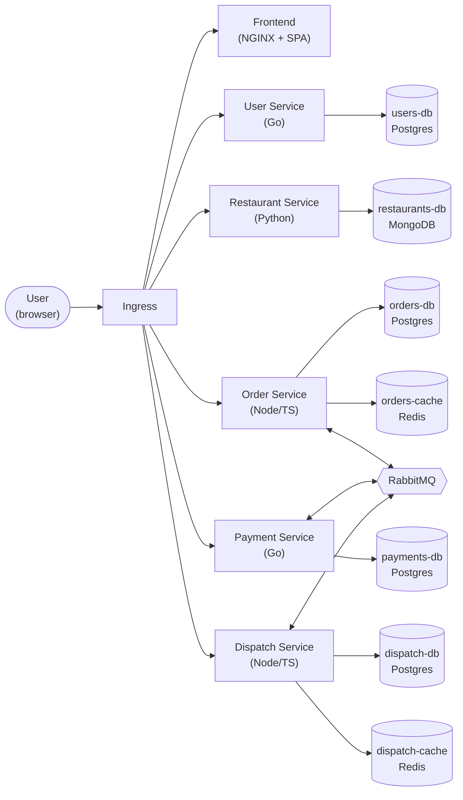
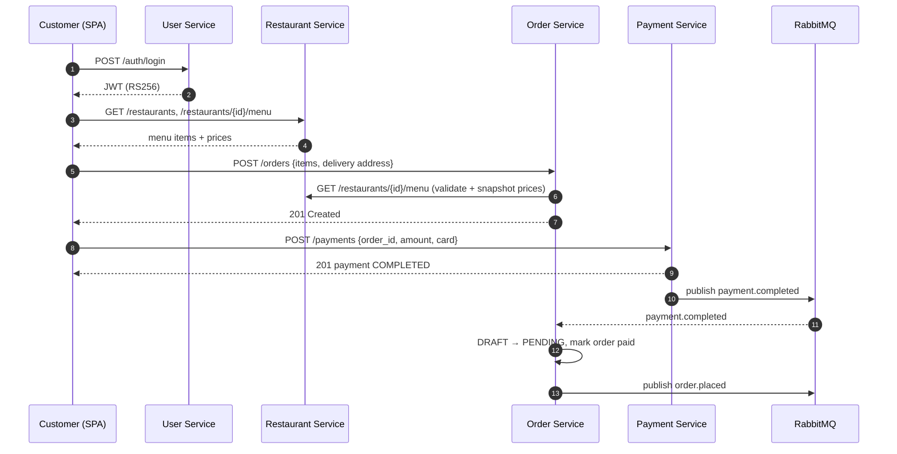
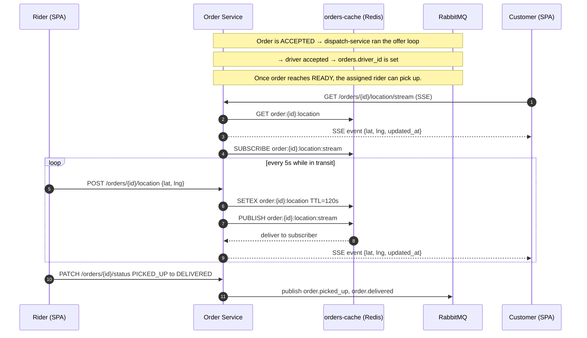
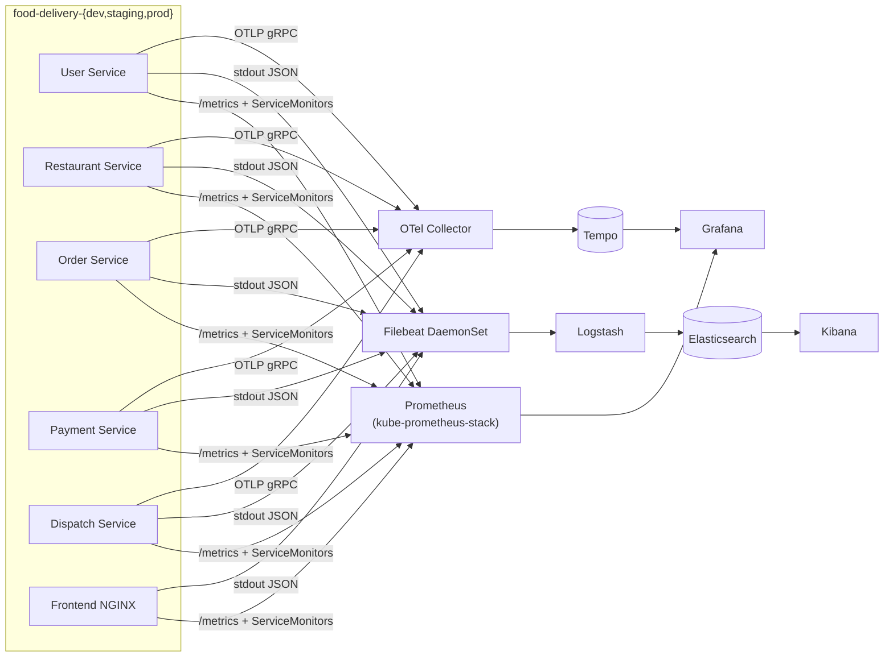
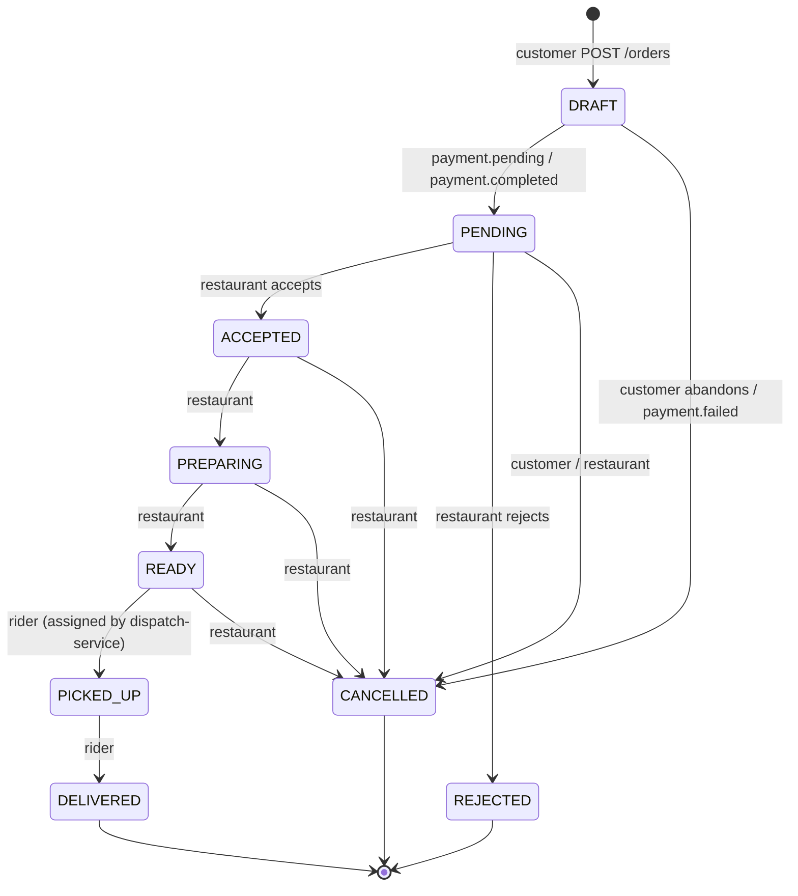
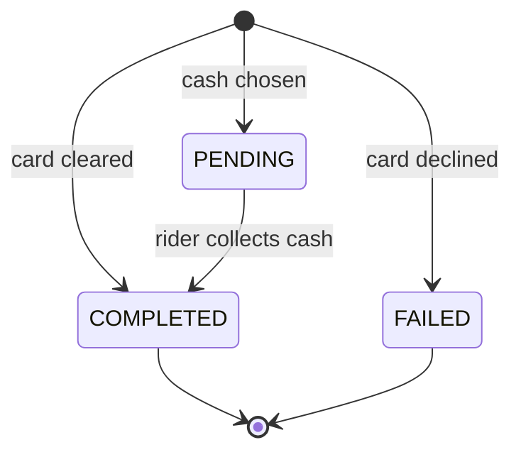
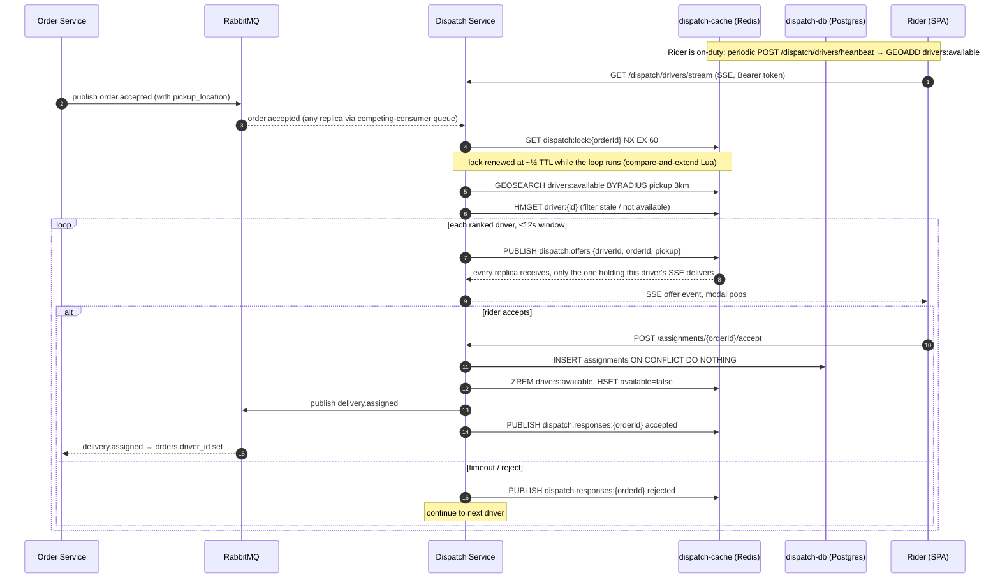
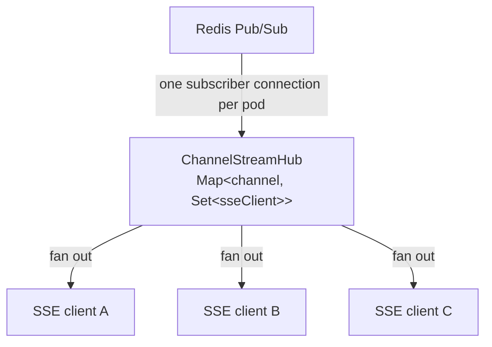

# Food Delivery Platform

A polyglot microservices food-delivery system built around five backend services
(User, Restaurant, Order, Payment, Dispatch), a static SPA frontend, RabbitMQ as
the event bus, per-service datastores, and a full three-pillar observability
stack. The same code targets local Docker Compose for everyday iteration and
Minikube + Kustomize for the Kubernetes story. The platform serves three user
roles end-to-end: **customers** (browse restaurants, place and pay for
orders), **restaurant owners** (publish menus, accept/prepare orders), and
**delivery riders** (go available, accept push offers from dispatch, push
live location, mark delivered).

## Architecture

The system is a small set of single-responsibility services that talk to
each other in two ways. Synchronous HTTP for read-after-write paths
(authenticate, fetch a restaurant menu, fetch an order) and asynchronous
events on RabbitMQ for everything that drives the order lifecycle
(`order.placed`, `payment.completed`, `order.ready`, `order.delivered`,
…). Each service owns its database — there is no shared schema and no
cross-service joins. The frontend is a static SPA served by an in-container
NGINX; a separate ingress NGINX/Traefik sits in front of everything as the
single public entry point. JWTs (RS256) are minted by User Service and
verified independently by every other service, which fetch User Service's
JWKS endpoint (`/.well-known/jwks.json`) at startup and cache the keys —
the standard OIDC pattern, so signing-key rotation needs no redeploy of
the verifiers.

### Component diagram



### Order placement (happy path)



### Real-time delivery tracking



### Observability data flow



## Components

### User Service

Go (Gin) on Postgres. Owns accounts, profiles, and
authentication. Hashes passwords with bcrypt; mints RS256 JWTs (with a `kid`
header) and publishes the matching public key as a JWKS at
`/.well-known/jwks.json` for the other services to verify against. It is the
only service that holds the signing key. No events.

### Restaurant Service

Python 3.12 (FastAPI) on MongoDB. Owns
restaurants and their menus (one-to-many embedded model). Verifies JWTs
against User Service's JWKS endpoint (keys fetched and cached locally). No
events; called synchronously by Order Service when a customer places an
order.

### Order Service

Node 20 / TypeScript (Express) on Postgres + Redis.
Owns the order lifecycle state machine and live delivery-rider
geolocation (short-TTL keys in Redis).



- **DRAFT** is the initial state when a customer places a cart. The
  order is invisible to the restaurant. The customer sees a "Resume
  checkout" affordance until they pick a payment method.
- **PENDING** means the customer has committed to a payment method
  (cash chosen, or card charged successfully) and the restaurant can
  now accept/reject.
- **CANCELLED** can come from the customer (DRAFT or PENDING), the
  system on `payment.failed`, or the restaurant up through READY.

Publishes `order.placed` (on `DRAFT → PENDING`, not on draft creation),
`order.accepted` (with `pickup_location`), `order.rejected`,
`order.ready`, `order.picked_up`, `order.delivered`, `order.cancelled`.
Consumes `payment.pending`, `payment.completed`, `payment.failed`,
`delivery.assigned`.

### Payment Service

Go (Gin) on Postgres. Mock card processor: any
card number ending in `0000` is declined, everything else clears. Cash
on delivery is supported as a separate flow.



- Card path goes straight to `COMPLETED` or `FAILED` — it never sits
  in `PENDING`.
- Cash path is the only one that dwells in `PENDING`; the rider flips
  it to `COMPLETED` via `POST /payments/by-order/{id}/collect`.

Publishes `payment.pending` (cash created), `payment.completed`
(card success or cash collected), `payment.failed` (card declined).
Consumes `order.rejected`, `order.cancelled` (refund hook — currently
a no-op log line).

### Dispatch Service

Node 20 / TypeScript (Express) on Postgres + Redis. Push-based driver
assignment. Triggered by
`order.accepted`; runs an offer loop that finds nearby available
drivers, ranks them by distance, and offers the order to one driver at
a time with a 12 s window. Postgres `assignments.order_id PK` is the
sole authority for who owns an order — concurrent `accept` calls race
on `INSERT … ON CONFLICT DO NOTHING`, exactly one wins.



Publishes `delivery.assigned`, optionally `dispatch.no_drivers`.
Consumes `order.accepted`, `order.cancelled` (broadcasts a global
cancel on `dispatch.responses:{orderId}` so any in-flight loop on any
pod aborts immediately and the rider's modal closes).

### Frontend

Single SPA (`src/app.js` + `src/styles.css` + `public/index.html`) served by
NGINX. One UI for all three roles, picked at registration time. Includes a
Leaflet map for delivery pickers and live tracking. `npm run build` does two
things: esbuild bundles `src/app.js` and its deps — `leaflet` and
`@microsoft/fetch-event-source` — into `dist/app.js` (a single IIFE, with
Leaflet's marker images emitted alongside as hashed assets), and the
Tailwind v4 CLI compiles `src/styles.css` (Tailwind + Leaflet's stylesheet)
into a tree-shaken `dist/styles.css`. The Dockerfile runs this; the NGINX
image serves `public/index.html` + `dist/*`. No third-party CDNs at runtime
(the in-browser Tailwind JIT is gone — that build is explicitly not for
production); only OpenStreetMap *tiles* are fetched from outside.

### Infrastructure

RabbitMQ as the only shared piece (topic exchange
`food_delivery`). Each backend service has its own database — four
Postgres instances (`users-db`, `orders-db`, `payments-db`,
`dispatch-db`) and one MongoDB (`restaurants-db`). Two Redis instances,
each private to one service: `orders-cache` holds ephemeral rider
locations; `dispatch-cache` holds the driver geo-index, the per-order
offer locks, and the Pub/Sub channels backing the dispatch SSE stream.
Neither Redis holds authoritative state — `dispatch-db.assignments` is
the single authority for who owns an order; Redis is throwaway.

### Observability

kube-prometheus-stack (Prometheus + Alertmanager +
Grafana) for metrics, ECK ELK (Elasticsearch + Logstash + Kibana +
Filebeat) for logs, Tempo + OTel Collector for traces. All three
pillars deploy once into a shared `observability` namespace and watch
all three application namespaces simultaneously.

### Ingress

Minikube's NGINX Ingress controller is the single public
entry point on Kubernetes; one Ingress per env routes
`<env>.food-delivery.local` and a separate observability Ingress
routes `*.observability.local`. Note that there are two NGINXes in
play: this **ingress controller** at the cluster edge, and the
**frontend pod's NGINX** that just serves static SPA files. Compose
uses Traefik as the gateway instead.

## Real-time Updates (SSE + Redis Pub/Sub)

The SPA never polls for live data. Instead, services that own real-time
state expose **Server-Sent Event** streams that push updates to the
browser as they happen, fed internally by **Redis Pub/Sub**. Today
order-service and dispatch-service both follow the same pattern; any
new service can adopt it with the shared `ChannelStreamHub` primitive.

### Streams

| Service | Endpoint | Used by | Pushes |
|---|---|---|---|
| order-service | `GET /orders/stream` | Customer order list / order detail / restaurant orders / rider's active deliveries | Order-state changes (`order.placed`, `order.accepted`, `order.ready`, `delivery.assigned`, `order.picked_up`, `order.delivered`, `order.cancelled`, `order.paid`) |
| order-service | `GET /orders/{id}/location/stream` | Customer's live-tracking map | Driver location fixes for one order |
| dispatch-service | `GET /dispatch/drivers/stream` | Driver dashboard | Push offers (`{driverId, orderId, pickup, expires_in_s}`) and cancellations (`{type: cancelled}`) |

The browser's native `EventSource` can't send an `Authorization` header, so
the SPA consumes these streams over `fetch()` instead — via
[`@microsoft/fetch-event-source`](https://github.com/Azure/fetch-event-source)
(one of the frontend's bundled deps) — which lets the JWT ride in the
`Authorization: Bearer …` header like every other request (no token in the
URL, so nothing leaks into access logs, history, or `Referer`). It also keeps
the connection open when the tab is backgrounded (`openWhenHidden`) so a
minimised driver still receives offers, and reconnects with backoff on a
dropped connection.

On the wire: each stream response sets `Content-Type: text/event-stream`,
`Cache-Control: no-cache, no-transform`, and `X-Accel-Buffering: no` (the last
tells nginx to stream this response unbuffered — set per-response by the
handler, so it touches only the SSE routes, not the JSON API), and the server
writes a `:hb` comment line every 25 s. The 25 s heartbeat sits comfortably
under nginx's default 60 s `proxy_read_timeout`, so idle streams aren't
reaped — no Ingress-wide buffering/timeout annotations are needed. Traefik
(Compose) streams responses unbuffered by default and needs no config either.

### Redis Pub/Sub as the fan-out bus

Whenever a producing service mutates state worth showing live (an
order transitions, a driver location ping arrives, dispatch offers an
order to a rider) it `PUBLISH`es a small envelope to one or more Redis
channels keyed by recipient. Channels are namespaced per producer so
there's no collision risk between services:

```
# order-service channels
customer:<userId>:orders          # this customer's orders changed
restaurant:<restaurantId>:orders  # this restaurant's orders changed
delivery:<userId>:orders          # this rider's deliveries changed
order:<orderId>:location:stream   # one driver-location fix

# dispatch-service channels
dispatch.offers                   # broadcast offer fan-in (per-pod filter)
dispatch.responses:<orderId>      # accept/reject signal back to the loop
driver:<driverId>:offers          # local SSE channel for one driver
```

Why a separate channel per recipient instead of a single firehose: the
SSE handler's auth has already pinned down *who* the connected client
is, so it subscribes only to channels relevant to that principal. No
cross-tenant leakage, no client-side filtering of unrelated events.

Two slightly different write patterns are used depending on whether
clients need a snapshot. Driver-location `POST`s `SETEX` first (so a
late SSE subscriber gets the last known fix immediately) and then
`PUBLISH`. Order-state mutations and dispatch offers skip the `SETEX`
— Postgres is the source of truth, and the SPA refetches when an event
arrives.

### Connection-budget control: in-process fan-out hub

A naive implementation opens **one Redis connection per connected SSE
client** (`redis.duplicate()` per request). At scale that exhausts
Redis's `maxclients` long before the Node HTTP server is the
bottleneck.

Instead each pod runs a single **`ChannelStreamHub`** that holds **one
Redis subscriber connection** for the lifetime of the process and
fans messages out to in-process listeners. The same class is reused
verbatim by order-service and dispatch-service:



Behaviour:

- The first listener for a channel triggers a Redis `SUBSCRIBE`.
- The last listener leaving triggers `UNSUBSCRIBE`, so idle channels
  aren't held open.
- Two customers watching the same order share **one** Redis
  subscription — the hub demultiplexes locally.

So the per-pod cost is bounded by what's actually being watched, not
by how many tabs are open:

| | Naive | This app |
|---|---|---|
| Redis connections per pod | `O(SSE clients)` | **1** |
| Redis SUBSCRIBEs per pod | `O(SSE clients)` | `O(channels currently watched)` |
| In-process fanout cost | n/a | one `Map.get` + a `Set` iteration per message |

Across pods the bus stays the same — Redis Pub/Sub broadcasts each
message to every subscribed pod, which then fans out to its own
locally-connected SSE clients. There's no sticky-session requirement
on the Ingress: a customer (or rider) can be load-balanced to any
replica and still receive their events, because every replica's hub
subscribes to the same recipient channels on demand. This is what lets
both order-service and dispatch-service scale horizontally without
session affinity.

## Project Structure

```
food-delivery/
├── services/                    # all microservices, one directory each
│   ├── user-service/            # Go + Gin + Postgres
│   ├── restaurant-service/      # Python + FastAPI + MongoDB
│   ├── order-service/           # Node/TS + Express + Postgres + Redis
│   ├── payment-service/         # Go + Gin + Postgres
│   ├── dispatch-service/        # Node/TS + Express + Postgres + Redis
│   └── frontend/                # SPA (src/ → esbuild + tailwind → dist/), served by NGINX
├── compose/                     # Docker Compose stack
│   ├── docker-compose.yml       # base topology
│   ├── docker-compose.dev.yml   # build images, expose all ports
│   ├── docker-compose.staging.yml  # pull staging images
│   ├── docker-compose.prod.yml  # pull pinned images, no debug ports
│   ├── .env.example             # copy to .env.dev / .env.staging / .env.prod
│   └── scripts/gen-keys.sh      # generates the JWT keypair for Compose
├── k8s/                         # Kubernetes (Kustomize) deployment
│   ├── base/                    # apps + per-service infra + base ingress
│   ├── overlays/{dev,staging,prod}/   # per-env namespace, image tag, replicas
│   └── observability/           # Prometheus / ELK / Tempo manifests + Helm values
├── scripts/                     # operator scripts
│   ├── app-env-bootstrap.sh     # creates a namespace, JWT keypair, pull secret
│   ├── observability-bootstrap.sh   # idempotent install of the observability stack
│   ├── observability-teardown.sh    # symmetric uninstall
│   ├── build.sh                 # docker build a single service
│   └── publish.sh               # docker push to a registry
└── specs/                       # design notes (not required reading)
```

## Prerequisites

- **Docker Engine** 24+ with **Docker Compose v2** (`docker compose`, not `docker-compose`)
- **Minikube** 1.32+ with the `ingress` and `metrics-server` addons enabled
- **kubectl** matching your cluster's minor version
- **Helm** 3.12+
- **OpenSSL** (for JWT keypair generation)
- A Bash-compatible shell (the scripts use `bash`)
- `/etc/hosts` write access to map the ingress hostnames:

```
$(minikube ip)  dev.food-delivery.local
$(minikube ip)  staging.food-delivery.local
$(minikube ip)  food-delivery.local
$(minikube ip)  grafana.observability.local
$(minikube ip)  kibana.observability.local
$(minikube ip)  prometheus.observability.local
```

No language toolchains are required on the host — every service builds inside
Docker.

## Development Environment Setup

The fast iteration loop is Docker Compose. From clone to a working SPA in the
browser:

```bash
# 1. Clone
git clone https://github.com/ThePainTester/food-delivery && cd food-delivery

# 2. Per-env env files (one-time)
cp compose/.env.example compose/.env.dev
cp compose/.env.example compose/.env.staging
cp compose/.env.example compose/.env.prod
# edit each so COMPOSE_PROJECT_NAME differs (food-delivery-dev, …)

# 3. JWT keypair for Compose (one-time)
compose/scripts/gen-keys.sh        # writes compose/jwt/{jwt.key,jwt.pub}

# 4. Bring up the dev stack (builds every image first run)
docker compose \
  -f compose/docker-compose.yml \
  -f compose/docker-compose.dev.yml \
  --env-file compose/.env.dev \
  up --build
```

URLs once the stack is healthy:

| What | URL |
|---|---|
| Frontend (SPA) | <http://localhost:3000> |
| Traefik dashboard | <http://localhost:8090> |
| RabbitMQ UI | <http://localhost:15672> (`guest` / `guest`) |
| Direct service ports (dev only) | `:8081` user, `:8082` restaurant, `:8083` order, `:8084` payment |

## Image Build & Publish

Both the Compose staging/prod stacks and the Kubernetes staging/prod overlays
pull images from a container registry — by default GitHub Container Registry
(`ghcr.io/<owner>/<service>:<version>`). The same publish flow feeds both.

```bash
# Log in once (needs a PAT with write:packages)
echo "$CR_PAT" | docker login ghcr.io -u <github-username> --password-stdin

# Publish a single service
./scripts/publish.sh <service> <version>

# Publish all services at one version
for s in user-service restaurant-service order-service payment-service dispatch-service frontend; do
  ./scripts/publish.sh "$s" v1.0.0
done
```

The published tag must match what the consuming env expects. Each service is
versioned **independently** — bumping order-service to `v3.0.0` doesn't force
the other services to rev. Both deployment paths reflect this:

- **Compose staging/prod** read `REGISTRY` plus per-service tag vars
  (`USER_SERVICE_TAG`, `RESTAURANT_SERVICE_TAG`, `ORDER_SERVICE_TAG`,
  `PAYMENT_SERVICE_TAG`, `DISPATCH_SERVICE_TAG`, `FRONTEND_TAG`) from
  `compose/.env.<env>`. Update only the tag(s) that changed.
- **Kubernetes staging/prod** pin per-service `newName`/`newTag` pairs inside
  `k8s/overlays/<env>/kustomization.yaml`'s `images:` block. Edit by hand, or
  run `kustomize edit set image food-delivery/<svc>=ghcr.io/<owner>/<svc>:<version>`
  from inside the overlay directory for the one service you bumped.

Staging and prod follow the **same** convention — both pin specific semver
tags pushed via the same script. The two configs (compose env file + k8s
overlay) must stay in sync per service; a small script or CI job that mirrors
the kustomize tag block into the env file is a reasonable next step.

> The registry namespace is hardcoded: `OWNER=thepaintester` in
> `scripts/publish.sh` and `ghcr.io/thepaintester/<svc>` in the overlays and
> compose env files. For a fork, change `OWNER` in `publish.sh` (or expose it
> via env var) and update each overlay's `newName` / `newTag` and each
> `compose/.env.<env>`'s `*_TAG` vars to your namespace and the versions you
> publish.

## Building Images Locally

You can build images locally and specify a tag using `./scripts/build.sh`

```bash
./scripts/build.sh <service> <tag>
```

## Compose Deployment (multi-environment)

All three environments are isolated by `COMPOSE_PROJECT_NAME` (set in their
`.env.<env>` file) — networks, volumes, and container names get auto-prefixed,
so the three stacks can run simultaneously on one host.

### Development

Builds images locally from `services/*`, exposes every port for debugging,
`restart: "no"`.

```bash
docker compose -f compose/docker-compose.yml -f compose/docker-compose.dev.yml \
  --env-file compose/.env.dev up -d --build
```

### Staging

Pulls pinned `${REGISTRY}/<svc>:${<SVC>_TAG}` images — each service has its
own per-service tag var (`USER_SERVICE_TAG`, `ORDER_SERVICE_TAG`, etc.) in
`compose/.env.staging`, mirroring the per-service `newTag` entries in
`k8s/overlays/staging/kustomization.yaml`. Same shape as prod, since staging
tracks prod's exact versions so the pre-release env matches what's about to
ship. See [Image Build & Publish](#image-build--publish) for how to push the
tags that `.env.staging` references. Exposes the gateway on `:8080` plus the
RabbitMQ UI; data stores stay internal. `restart: unless-stopped`.

```bash
docker compose -f compose/docker-compose.yml -f compose/docker-compose.staging.yml \
  --env-file compose/.env.staging up -d
```

### Production

Pulls pinned `${REGISTRY}/<svc>:${<SVC>_TAG}` images, with no fallback —
each per-service tag must be set in `compose/.env.prod` or compose refuses
to start (mirrors the `newTag` entries in
`k8s/overlays/prod/kustomization.yaml`). Publishes only `:80` and `:443` on
the gateway; nothing else is reachable from the host. Adds log rotation.
`restart: always`.

```bash
docker compose -f compose/docker-compose.yml -f compose/docker-compose.prod.yml \
  --env-file compose/.env.prod up -d
```

### Inspect / tear down a single env

```bash
docker compose --env-file compose/.env.<env> ps
docker compose --env-file compose/.env.<env> logs -f gateway
docker compose -f compose/docker-compose.yml -f compose/docker-compose.<env>.yml \
  --env-file compose/.env.<env> down -v
```

> Use `--env-file` (not `-p`) for stack selection. `-p` sets the project
> name for prefixing but does not populate `${COMPOSE_PROJECT_NAME}` for
> variable substitution, which Traefik labels rely on.

## Kubernetes Deployment

The Kustomize tree under `k8s/` mirrors the Compose stack with three overlays
(`dev` / `staging` / `prod`) that each live in their own namespace, on their
own ingress host, so they coexist on one Minikube.

### 1. Build images into Minikube's Docker daemon

The `dev` overlay uses `imagePullPolicy: IfNotPresent` and references local
image tags (`:dev`). Build them inside Minikube's daemon so the cluster can
find them with no registry round-trip:

```bash
eval $(minikube docker-env)

docker compose -f compose/docker-compose.yml -f compose/docker-compose.dev.yml \
  --env-file compose/.env.dev build
```

Same-tag rebuilds need a manual `kubectl rollout restart deploy/<service>`
because `IfNotPresent` won't refetch.

### 2. Point staging/prod overlays at your published images

Skip for `dev` (it uses the local Minikube-built image). For staging/prod,
publish the images first (see [Image Build & Publish](#image-build--publish)),
then update each overlay's `images:` block so `newName` is your registry
namespace and `newTag` is the version you pushed:

```bash
cd k8s/overlays/staging   # or prod
for s in user-service restaurant-service order-service payment-service dispatch-service frontend; do
  kustomize edit set image food-delivery/$s=ghcr.io/<owner>/$s:v1.0.0
done
```

(or edit the `kustomization.yaml` directly).

### 3. Bootstrap the application namespace

`scripts/app-env-bootstrap.sh` creates the namespace, generates the JWT
signing key as a `Secret` (`jwt-privkey`, mounted only into user-service),
and (for staging/prod only) creates the `ghcr-credentials` image-pull Secret
from `$CR_PAT`:

```bash
./scripts/app-env-bootstrap.sh food-delivery-dev               # CR_PAT not required
CR_PAT=ghp_xxx ./scripts/app-env-bootstrap.sh food-delivery-staging
CR_PAT=ghp_xxx ./scripts/app-env-bootstrap.sh food-delivery-prod
```

### 4. Apply the overlay

```bash
kubectl apply -k k8s/overlays/dev
kubectl apply -k k8s/overlays/staging
kubectl apply -k k8s/overlays/prod
```

Each Deployment runs `golang-migrate` as an `initContainer` against its own
Postgres before the app starts; migrations are baked into the service image.
Re-applying is safe.

### 5. Deploy the observability stack

One install, watching all three app namespaces:

```bash
./scripts/observability-bootstrap.sh
```

The script is idempotent and runs the Helm installs + ECK CRDs in dependency
order:

```
helm install eck-operator     elastic/eck-operator                 -f k8s/observability/elastic/eck-operator.values.yaml
helm install kps              prometheus-community/kube-prometheus-stack -f k8s/observability/prometheus/kube-prometheus-stack.values.yaml
helm install tempo            grafana/tempo                        -f k8s/observability/tracing/tempo.values.yaml
helm install otel-collector   open-telemetry/opentelemetry-collector -f k8s/observability/tracing/otel-collector.values.yaml
kubectl apply -f k8s/observability/elastic/{elasticsearch,kibana,logstash,filebeat,ilm-bootstrap}.yaml
kubectl apply -f k8s/observability/tracing/grafana-datasource-tempo.yaml
kubectl apply -f k8s/observability/ingress/observability-ingress.yaml
kubectl apply -f k8s/observability/prometheus/service-monitors/
kubectl apply -f k8s/observability/prometheus/dashboards/
```

`scripts/observability-teardown.sh` is the symmetric uninstall.

### 6. /etc/hosts

```
$(minikube ip)  dev.food-delivery.local
$(minikube ip)  staging.food-delivery.local
$(minikube ip)  food-delivery.local
$(minikube ip)  grafana.observability.local
$(minikube ip)  kibana.observability.local
$(minikube ip)  prometheus.observability.local
```

### 7. Verify

```bash
kubectl -n food-delivery-dev get pods
kubectl -n food-delivery-dev rollout status deploy/order-service
curl -sSf http://dev.food-delivery.local/healthz
```

Open the SPA at <http://dev.food-delivery.local>.

### Tear down

```bash
kubectl delete -k k8s/overlays/dev
# or
kubectl delete namespace food-delivery-dev    # also drops PVCs
```

## Observability Access

| Stack | URL | Default creds | What to look at |
|---|---|---|---|
| Grafana | <http://grafana.observability.local> | `admin / admin` | Dashboards → "Food Delivery" folder: Service RED, Order Pipeline, Ingress (NGINX), Frontend NGINX |
| Kibana | <http://kibana.observability.local> | `elastic` (password in `elasticsearch-es-elastic-user` Secret) | Discover → index pattern `food-delivery-*` |
| Prometheus | <http://prometheus.observability.local> | none | Try `sum by (service) (rate(http_requests_total[5m]))` |
| Tempo | inside Grafana → Explore → datasource `Tempo` | n/a | Search by `trace_id`, or use the "Logs ↔ Traces" link in the Service RED dashboard |

Sample Kibana queries:

- `service.keyword: "order-service" and level.keyword: "error"` — recent error logs from order-service
- `trace_id: "<id>"` — every log line tagged with a given trace, across services

To find a trace from a log: copy the log entry's `trace_id` field, paste into
Grafana Explore → Tempo. To go the other way: open a span in Tempo, click
"Logs for this span", which queries Loki/ES with the same `trace_id`.

## Repository Conventions

**Image tagging**

| Env | Tag | Source |
|---|---|---|
| Compose dev / k8s dev | `:dev` (local) | Compose build, optionally into the Minikube daemon |
| Compose staging / k8s staging | pinned semver, e.g. `v1.0.0` | `scripts/publish.sh` → ghcr |
| Compose prod / k8s prod | pinned semver, e.g. `v1.0.0` | `scripts/publish.sh` → ghcr |

Staging and prod use the **same** pinned tag scheme — staging tracks prod's
exact version. The kustomize overlays rewrite the image name from the
unprefixed `food-delivery/<service>` (used in base manifests) to the
registry-qualified form for staging/prod.

**Secrets**

The JWT signing key is per-cluster — the `jwt-privkey` Secret is generated by
`scripts/app-env-bootstrap.sh` and gitignored (template alongside as
`jwt-privkey.example.yaml`); it's mounted only into user-service, which
publishes the public half at `/.well-known/jwks.json`. Database passwords and the
RabbitMQ credentials are also stored as Secrets per service. Image-pull
credentials for staging/prod come from `$CR_PAT` at bootstrap time and are
never written to disk.
